# ACIT 2420 Week 11 Lab: NGINX Server

## Team Members

### Aashay Bharadwaj 
### Hei Shun Kong

## Description

Using the NGINX server to serve an html file when the virtual machines IP is accessed using a web browser.

***NOTE: In order to get started first create a new droplet on digital ocean called web-one.***

### Step 1: Install NGINX on the server we just created. 

  1. Run the following command: `sudo apt install nginx`
  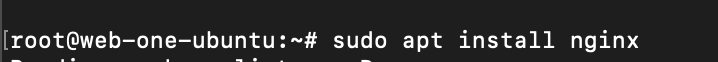
  3. While installing the files you will be asked to enter Y or n: Enter `Y`
  
### Step 2 & 3: Create HTML and Server Block Files
  1. Create an empty folder on your host machine.
  2. Using any choice of editor create two files inside the folder created in step 1:
      1. ip_address: Create a file named the ip address of the droplet web-one and paste the following code:
      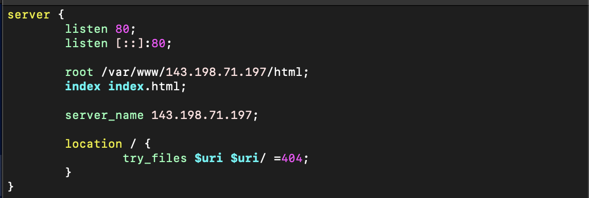
      2. HTML file: Create a HTML file named index.html and write some text on the webpage
    
### Step 4: Upload Files created in Step 2 & 3 to the server. 
  1. Open a new terminal/command prompt window connect using sftp: `sftp -i .ssh/web-one root@ip_address`
  2. Once connected make the follwing directories:
      1. Enter the following command to create the following directory:   `mkdir /var/www/ip-address`
      2. Enter the following command to create the following directory: `mkdir /var/www/ip-address/html`
      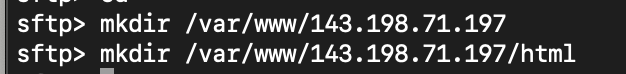
  3. Navigate to the folder containing the server block and html files using lcd command
  
  5. Navigate to /var/www/ip-address/html directory using the cd command: `cd /var/www/ip-address/html`
  6. Upload the html file to this location using put command: `put index.html`
  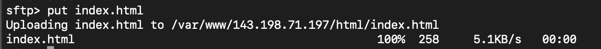
  6. `Enter cd`
  7. Navigate to /etc/nginx/sites-available directory using cd command: `cd /etc/nginx/sites-available`
  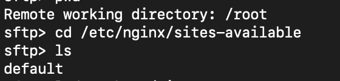
  8. Upload the server block file using the put command: `put ip_address`
  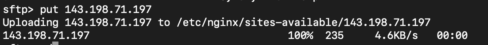
  9. Once the files are uploaded open them using `vim` to make sure the conents are correct.
  10. Create a link for the new server block we created. Enter `sudo ln -s /etc/nginx/sites-available/ip_address /etc/nginx/sites-enabled/`
  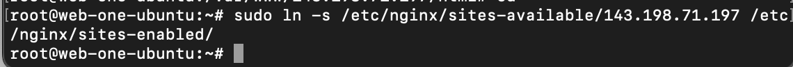
  
### Step 5: Restart the NGINX Service
  1. Enter the following command to check if the syntax is correct: `sudo nginx -t`
  2. Enter the following command to restart the service: `sudo systemctl restart nginx`
  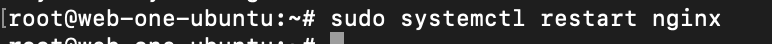
  
## Step 6: Access html file using web browser
  1. Open any browser of choice and Enter `ip_address` in the search bar
  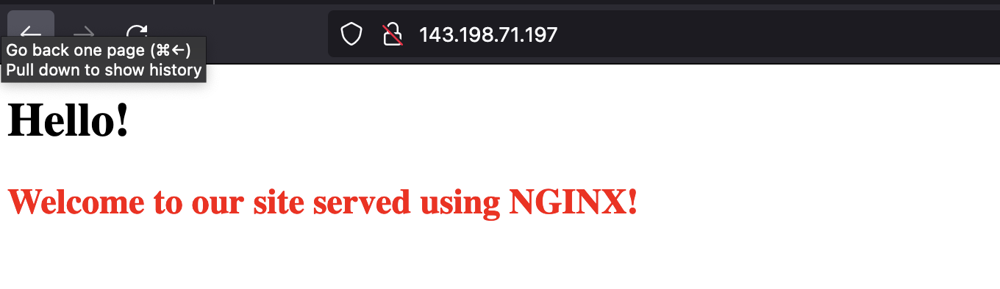
  
## Step 7: Setup Firewall using UFW
  1. To enable a firewall using UFW Enter: `sudo ufw enable`
  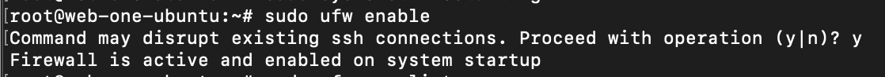
      1. To allow HTTP: `sudo ufw allow 'Nginx HTTP'`
      2. To allow SSH: `sudo ufw allow 'OpenSSH'`
      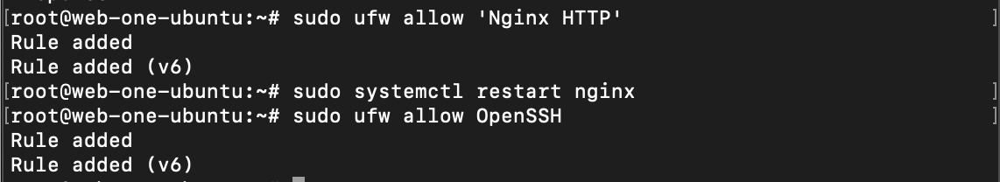

## Step 8: Check Firewall Exceptions:
  1. Restart the service: `sudo systemctl restart nginx`
  2. Try to access HTML file using the web browser
  3. Try to reconnect to the droplet using SSH: `ssh -i ~/.ssh/web-one root@ip_address
  
  ***NOTE: Replace ip_address with the ip address of web-one droplet***

